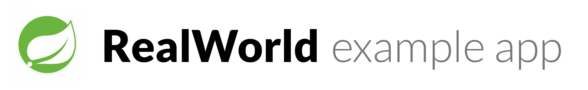

# 

> ### Spring boot + MyBatis codebase containing real world examples (CRUD, auth, advanced patterns, etc) that adheres to the [RealWorld](https://github.com/gothinkster/realworld-example-apps) spec and API.

This codebase was created to demonstrate a fully fledged fullstack application built with Spring boot + Mybatis including CRUD operations, authentication, routing, pagination, and more.

For more information on how to this works with other frontends/backends, head over to the [RealWorld](https://github.com/gothinkster/realworld) repo.

# How it works

The application uses Spring boot (Web, Mybatis).

* Use the idea of Domain Driven Design to separate the business term and infrastruture term.
* Use MyBatis to implement the [Data Mapper](https://martinfowler.com/eaaCatalog/dataMapper.html) pattern for persistence.
* Use [CQRS](https://martinfowler.com/bliki/CQRS.html) pattern to separate the read model and write model.

And the code organize as this:

1. `api` is the web layer to implement by Spring MVC
2. `core` is the business model including entities and services
3. `application` is the high level services for query with the data transfer objects
4. `infrastructure`  contains all the implementation classes as the technique details

# Security

Integration with Spring Security and add other filter for jwt token process.

The secret key is stored in `application.properties`.

# Database

It uses a H2 in memory database (for now), can be changed easily in the `application.properties` for any other database.

# Getting started

You need Java installed.

    ./gradlew bootRun
    open http://localhost:8080

# Try it out with [Docker](https://www.docker.com/)

You need Docker installed.
	
	docker-compose up -d

# Run test

The repository contains a lot of test cases to cover both api test and repository test.

    ./gradlew test

# Help

Please fork and PR to improve the code.