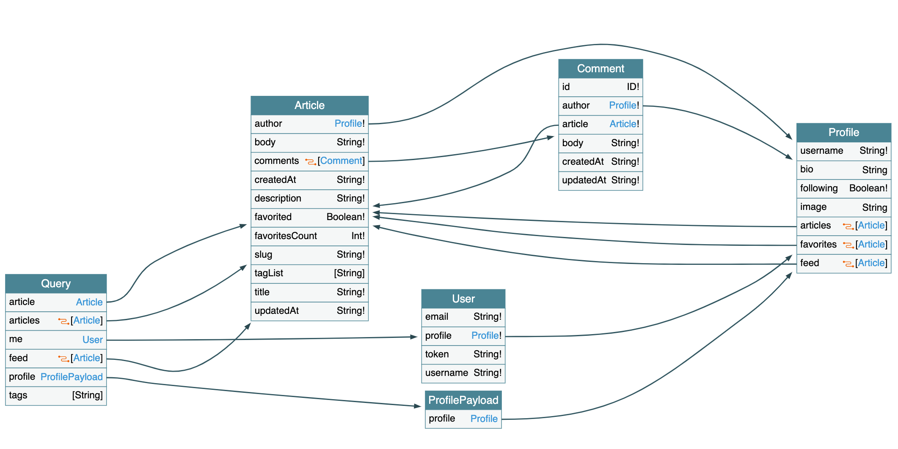

# 

> ### Spring boot + MyBatis codebase containing real world examples (CRUD, auth, advanced patterns, etc) that adheres to the [RealWorld](https://github.com/gothinkster/realworld-example-apps) spec and API.

This codebase was created to demonstrate a fully fledged fullstack application built with Spring boot + Mybatis including CRUD operations, authentication, routing, pagination, and more.

For more information on how to this works with other frontends/backends, head over to the [RealWorld](https://github.com/gothinkster/realworld) repo.

# *NEW* GraphQL Support  

Following some DDD principle. The REST or GraphQL is just kind of adapter. And the domain layer will be consistent all the time. So this repository implement GraphQL and REST at the same time.

The GraphQL schema is https://github.com/gothinkster/spring-boot-realworld-example-app/blob/master/src/main/resources/schema/schema.graphqls and the visualization looks like below.

And this implementation is using [dgs-framework](https://github.com/Netflix/dgs-framework) which is a quite new java graphql server framework.
# How it works

The application uses Spring boot (Web, Mybatis).

* Use the idea of Domain Driven Design to separate the business term and infrastruture term.
* Use MyBatis to implement the [Data Mapper](https://martinfowler.com/eaaCatalog/dataMapper.html) pattern for persistence.
* Use [CQRS](https://martinfowler.com/bliki/CQRS.html) pattern to separate the read model and write model.

And the code organize as this:

1. `api` is the web layer to implement by Spring MVC
2. `core` is the business model including entities and services
3. `application` is the high level services for query with the data transfer objects
4. `infrastructure`  contains all the implementation classes as the technique details

# Security

Integration with Spring Security and add other filter for jwt token process.

The secret key is stored in `application.properties`.

# Database

It uses a ~~H2 in memory database~~ sqlite database (for easy local test without lost test data after every restart), can be changed easily in the `application.properties` for any other database.

# Getting started

You need Java 8 installed.

    ./gradlew bootRun

To test that it works, open a browser tab at http://localhost:8080/tags .  
Alternatively, you can run

    curl http://localhost:8080/tags

# Try it out with [Docker](https://www.docker.com/)

You need Docker installed.
	
	docker-compose up -d

# Try it out with a RealWorld frontend

The entry point address of the backend API is at http://localhost:8080, **not** http://localhost:8080/api as some of the frontend documentation suggests.

# Run test

The repository contains a lot of test cases to cover both api test and repository test.

    ./gradlew test

# Use git pre-commit hook

Follow the instruction from [google-java-format-git-pre-commit-hook](https://github.com/a1exsh/google-java-format-git-pre-commit-hook) to use a `pre-commit` hook to make the code format style stable from different contributors.

# Help

Please fork and PR to improve the code.
